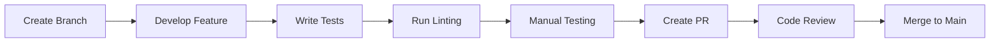

# Development Guide - Student Management System Frontend

## Quick Start Guide

### Prerequisites
- **Node.js**: Version 20.x or higher
- **npm**: Latest version (comes with Node.js)
- **Git**: For version control
- **VS Code**: Recommended editor with extensions
- **Modern Browser**: Chrome, Firefox, Safari, or Edge

### Initial Setup
```powershell
# Clone the repository
git clone [repository-url]
cd courses-platforms/Repo-next/Client

# Install dependencies
npm install

# Set up environment variables
cp .env.example .env.local
# Edit .env.local with your API URL

# Start development server
npm run dev
```

### Development Server
- **URL**: http://localhost:3000
- **Hot Reload**: Enabled with Turbopack
- **TypeScript**: Real-time type checking
- **ESLint**: Automatic code quality checks

## Project Structure Deep Dive

### Core Directories
```
src/
├── app/                    # Application State
│   ├── api/               # RTK Query API slices
│   ├── constants.ts       # Application constants
│   └── store.ts           # Redux store configuration
├── components/            # Reusable Components
│   ├── providers/         # React context providers
│   └── ui/               # Design system components
├── lib/                   # Utility functions
├── pages/                # Next.js pages (file-based routing)
├── styles/               # Global styles and CSS
└── types/                # TypeScript type definitions
```

### File Naming Conventions
- **Components**: PascalCase (`StudentCard.tsx`)
- **Pages**: kebab-case (`student-details.tsx`)
- **Utilities**: camelCase (`formatDate.ts`)
- **Types**: PascalCase with suffix (`StudentType.ts`)
- **Constants**: UPPER_SNAKE_CASE (`API_ENDPOINTS.ts`)

## Development Workflow

### 1. Feature Development Process


### 2. Component Development
```typescript
// Component template
import React from 'react';
import { cn } from '@/lib/utils';

interface ComponentProps {
  // Define props interface
  className?: string;
  children?: React.ReactNode;
}

const Component = React.forwardRef<
  HTMLDivElement,
  ComponentProps
>(({ className, children, ...props }, ref) => (
  <div
    ref={ref}
    className={cn("base-styles", className)}
    {...props}
  >
    {children}
  </div>
));

Component.displayName = "Component";

export { Component };
```

### 3. API Integration Pattern
```typescript
// 1. Define types
interface Student {
  _id: string;
  name: string;
  email: string;
}

// 2. Create API slice
export const studentApiSlice = apiSlice.injectEndpoints({
  endpoints: (builder) => ({
    getStudents: builder.query<Student[], void>({
      query: () => '/students',
      providesTags: ['Student']
    })
  })
});

// 3. Use in component
const { data: students, isLoading, error } = useGetStudentsQuery();
```

## Code Standards

### TypeScript Guidelines
- **Strict Mode**: Always enabled
- **Interface over Type**: Use interfaces for object shapes
- **Explicit Return Types**: For public functions
- **No Any**: Avoid `any` type, use `unknown` if needed

```typescript
// Good
interface StudentProps {
  student: Student;
  onSelect: (student: Student) => void;
}

// Avoid
type StudentProps = {
  student: any;
  onSelect: Function;
}
```

### Component Guidelines
- **Single Responsibility**: One purpose per component
- **Props Interface**: Always define TypeScript interfaces
- **Forward Refs**: For DOM access and third-party integration
- **Display Names**: Set for better debugging

```typescript
// Good component structure
const StudentCard = React.forwardRef<
  HTMLDivElement,
  StudentCardProps
>(({ student, onSelect, className, ...props }, ref) => {
  // Component logic here
  
  return (
    <Card ref={ref} className={cn("student-card", className)} {...props}>
      {/* Component JSX */}
    </Card>
  );
});

StudentCard.displayName = "StudentCard";
```

### Styling Guidelines
- **Tailwind First**: Use Tailwind utilities before custom CSS
- **Component Variants**: Use CVA for component variants
- **Responsive Design**: Mobile-first approach
- **Design Tokens**: Use CSS custom properties for theming

```typescript
// Component variants with CVA
const buttonVariants = cva(
  "inline-flex items-center justify-center rounded-md text-sm font-medium",
  {
    variants: {
      variant: {
        default: "bg-primary text-primary-foreground hover:bg-primary/90",
        destructive: "bg-destructive text-destructive-foreground hover:bg-destructive/90",
      },
      size: {
        default: "h-10 px-4 py-2",
        sm: "h-9 rounded-md px-3",
        lg: "h-11 rounded-md px-8",
      },
    },
    defaultVariants: {
      variant: "default",
      size: "default",
    },
  }
);
```

## State Management

### Redux Toolkit Store Structure
```typescript
// Store configuration
export const store = configureStore({
  reducer: {
    [apiSlice.reducerPath]: apiSlice.reducer,
  },
  middleware: (getDefaultMiddleware) =>
    getDefaultMiddleware().concat(apiSlice.middleware),
});

// Type definitions
export type RootState = ReturnType<typeof store.getState>;
export type AppDispatch = typeof store.dispatch;
```

### RTK Query Best Practices
- **Feature-based Slices**: Separate API slices per feature
- **Cache Tags**: Use for intelligent cache invalidation
- **Error Handling**: Consistent error handling patterns
- **Loading States**: Handle loading and error states

```typescript
// API slice with proper error handling
export const studentApiSlice = apiSlice.injectEndpoints({
  endpoints: (builder) => ({
    getStudents: builder.query<PaginatedStudentsResponse, number>({
      query: (page) => `/students?page=${page}`,
      providesTags: (result, error, page) =>
        result
          ? [
              ...result.students.map(({ _id }) => ({ type: 'Student' as const, id: _id })),
              { type: 'Student', id: 'LIST' },
            ]
          : [{ type: 'Student', id: 'LIST' }],
    }),
  }),
});
```

## Testing Strategy

### Component Testing
```typescript
// Component test example
import { render, screen } from '@testing-library/react';
import { StudentCard } from './StudentCard';

const mockStudent = {
  _id: '1',
  name: 'John Doe',
  email: 'john@example.com',
  // ... other properties
};

describe('StudentCard', () => {
  it('renders student information', () => {
    render(<StudentCard student={mockStudent} />);
    
    expect(screen.getByText('John Doe')).toBeInTheDocument();
    expect(screen.getByText('john@example.com')).toBeInTheDocument();
  });
});
```

### API Testing
```typescript
// API test with MSW (Mock Service Worker)
import { rest } from 'msw';
import { setupServer } from 'msw/node';

const server = setupServer(
  rest.get('/api/students', (req, res, ctx) => {
    return res(ctx.json({ students: [mockStudent] }));
  })
);

beforeAll(() => server.listen());
afterEach(() => server.resetHandlers());
afterAll(() => server.close());
```

## Performance Optimization

### Code Splitting
```typescript
// Dynamic imports for code splitting
const LazyComponent = dynamic(() => import('./HeavyComponent'), {
  loading: () => <LoadingSpinner />,
});

// Route-based splitting (automatic with Next.js pages)
// pages/students/[id].tsx automatically creates a chunk
```

### Memoization
```typescript
// Component memoization
const StudentCard = React.memo(({ student, onSelect }) => {
  // Component implementation
});

// Hook memoization
const expensiveValue = useMemo(() => {
  return computeExpensiveValue(data);
}, [data]);

// Callback memoization
const handleSelect = useCallback((student: Student) => {
  onSelect(student);
}, [onSelect]);
```

### Image Optimization
```typescript
// Next.js Image component
import Image from 'next/image';

<Image
  src="/student-avatar.jpg"
  alt="Student Avatar"
  width={64}
  height={64}
  className="rounded-full"
  priority // For above-the-fold images
/>
```

## Debugging

### Development Tools
- **React DevTools**: Component inspection and profiling
- **Redux DevTools**: State debugging and time-travel
- **Next.js DevTools**: Bundle analysis and performance
- **Browser DevTools**: Network, performance, and console debugging

### Common Debugging Patterns
```typescript
// Debug API calls
const { data, isLoading, error, refetch } = useGetStudentsQuery(page, {
  refetchOnMountOrArgChange: true,
});

// Log query state for debugging
console.log({ data, isLoading, error });

// Debug component renders
useEffect(() => {
  console.log('Component rendered with:', { student, isSelected });
}, [student, isSelected]);
```

### Error Boundaries
```typescript
// Error boundary for crash recovery
class ErrorBoundary extends React.Component {
  constructor(props) {
    super(props);
    this.state = { hasError: false };
  }

  static getDerivedStateFromError(error) {
    return { hasError: true };
  }

  componentDidCatch(error, errorInfo) {
    console.error('Error caught by boundary:', error, errorInfo);
  }

  render() {
    if (this.state.hasError) {
      return <ErrorFallback />;
    }

    return this.props.children;
  }
}
```

## Build and Deployment

### Build Process
```powershell
# Development build
npm run dev

# Production build
npm run build

# Start production server
npm start

# Lint code
npm run lint

# Type check
npx tsc --noEmit
```

### Environment Configuration
```env
# .env.local (local development)
NEXT_PUBLIC_API_URL=http://localhost:8000/api

# .env.production (production)
NEXT_PUBLIC_API_URL=https://api.production.com

# .env.staging (staging)
NEXT_PUBLIC_API_URL=https://api.staging.com
```

### Production Checklist
- [ ] Environment variables configured
- [ ] API endpoints updated
- [ ] Bundle size optimized
- [ ] Images optimized
- [ ] Error tracking configured
- [ ] Analytics implemented
- [ ] Security headers configured
- [ ] Performance monitoring enabled

## Troubleshooting

### Common Issues

#### Build Errors
```bash
# Clear Next.js cache
rm -rf .next

# Clear node_modules and reinstall
rm -rf node_modules package-lock.json
npm install

# TypeScript errors
npx tsc --noEmit
```

#### Development Server Issues
```bash
# Port already in use
npx kill-port 3000

# Memory issues
export NODE_OPTIONS="--max-old-space-size=4096"
npm run dev
```

#### API Integration Issues
```typescript
// Check network requests in browser DevTools
// Verify CORS configuration
// Check API endpoint URLs
// Validate request/response formats
```

### Getting Help
- **Documentation**: Check this memory bank for comprehensive information
- **GitHub Issues**: Create issues for bugs or feature requests  
- **Code Reviews**: Ask for help in pull requests
- **Team Chat**: Use team communication channels
- **Stack Overflow**: For general React/Next.js questions

## Best Practices Summary

### Code Quality
- Write TypeScript interfaces for all data structures
- Use ESLint and follow configuration rules
- Write meaningful component and function names
- Keep components small and focused
- Use proper error handling patterns

### Performance
- Implement proper loading states
- Use React.memo for expensive components
- Optimize images with Next.js Image component
- Implement proper caching strategies
- Monitor bundle size regularly

### Accessibility
- Use semantic HTML elements
- Implement proper ARIA attributes with Radix UI
- Ensure keyboard navigation works
- Test with screen readers
- Maintain proper color contrast ratios

### Security
- Validate all user inputs with Zod
- Store sensitive data securely
- Use HTTPS in production
- Implement proper authentication flows
- Keep dependencies updated

This development guide should provide all the information needed for developers to quickly understand and contribute to the Student Management System frontend effectively.
